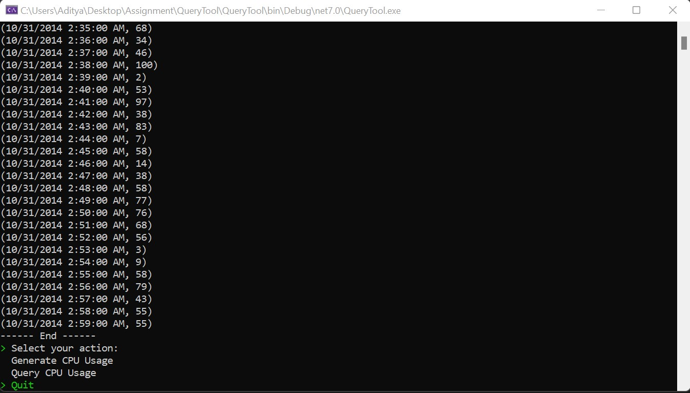

## Command line interface for generating and querying logs

Interactive command-line based application framework built on .NET 7.0 Standard by using the following libraries

1. Sharprompt
2. CSVHelper

## Features

1. Multi-platform support
2. Generate logs for a given date
3. Query logs using the IP Address and timestamp

## Running the application

The application needs to have dotnet SDKs installed for running the application from the CLI.

Building the application - dotnet build /nowarn:msb4011
Running the application - dotnet run

## Functionality

The app can perform any of the following operations

## Working of the app

1. Generate function - We will be generating roughly 1000 * 2 * 24 * 60 records for 1000 servers and 2 CPUs.
    a. In order to generate such enormous data, we'll split up the records into multiple CSVs and query based on the time provided
    b. We'll split up the CSV based on the hourly data from the server

2. Query function - In the initial load, we'll load everything in the Hashmap. Based on the query we would be querying the data from the IEnumerable. 

## Future Scope
1. Implement Multi-Threading to increase the writing/reading speed

## Total Time Taken 

~ 12 hours

Analysis and POC - 4 hours

Building Generate Function - 3 hours

Building UI and Query Function - 5 hours